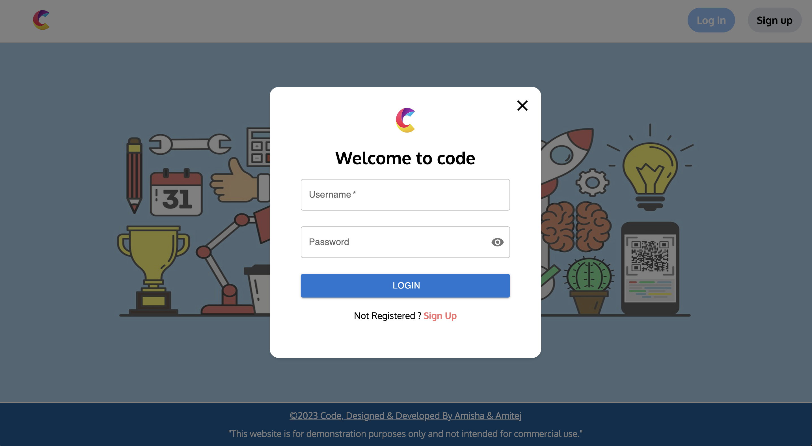
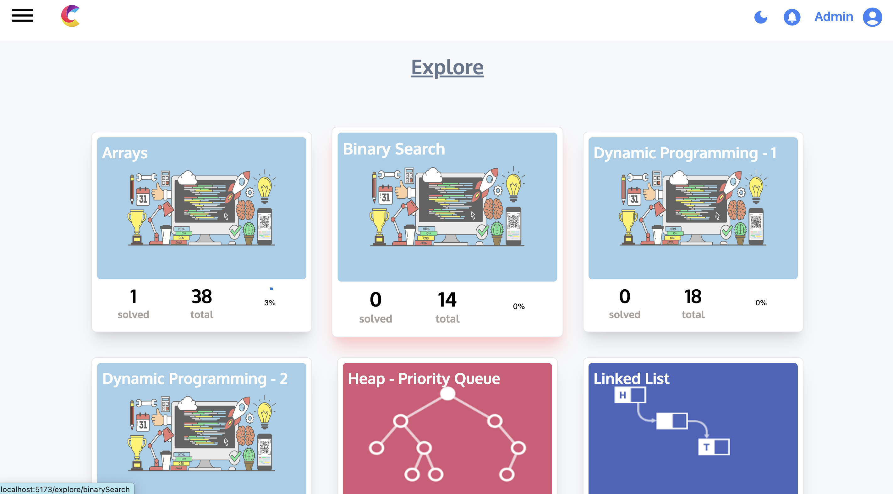
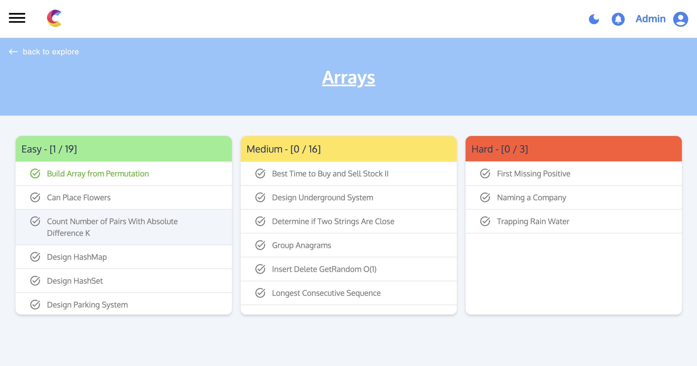
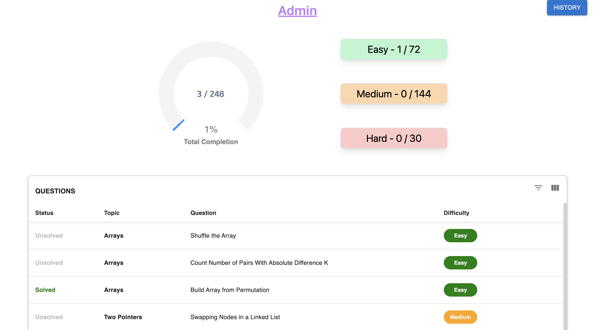

# Interview Edge

Interview Edge is a web application designed to help users practice coding interview questions. 






## Table of Contents

- [Features](#features)
- [Installation](#installation)
- [Usage](#usage)


## Features

- A comprehensive repository of popular coding interview questions, enabling users to enhance their coding skills and prepare for technical interviews effectively.
- Has a progress tracking feature to monitor and analyze individual user performance, helping users identify areas for improvement and optimize their preparation for coding interviews.

## Installation

To install dependencies

```bash
npm install
```


## Usage

To run the server

1. With Gunicorn

```bash
npm start
```


